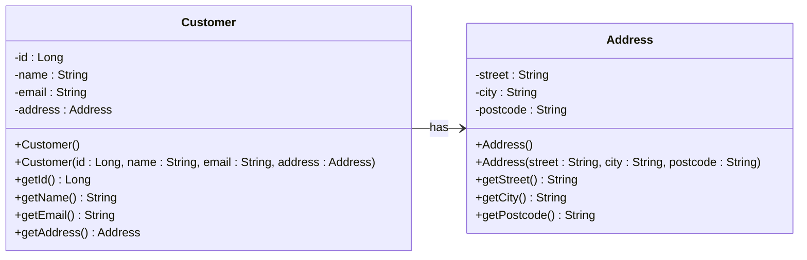

# Customer and Address — UML Class Diagram

```mermaid
classDiagram
    direction LR
    class Customer {
        -id : Long
        -name : String
        -email : String
        -address : Address
        +Customer()
        +Customer(id : Long, name : String, email : String, address : Address)
        +getId() Long
        +getName() String
        +getEmail() String
        +getAddress() Address
    }
    class Address {
        -street : String
        -city : String
        -postcode : String
        +Address()
        +Address(street : String, city : String, postcode : String)
        +getStreet() String
        +getCity() String
        +getPostcode() String
    }
    Customer --> Address : has
```
