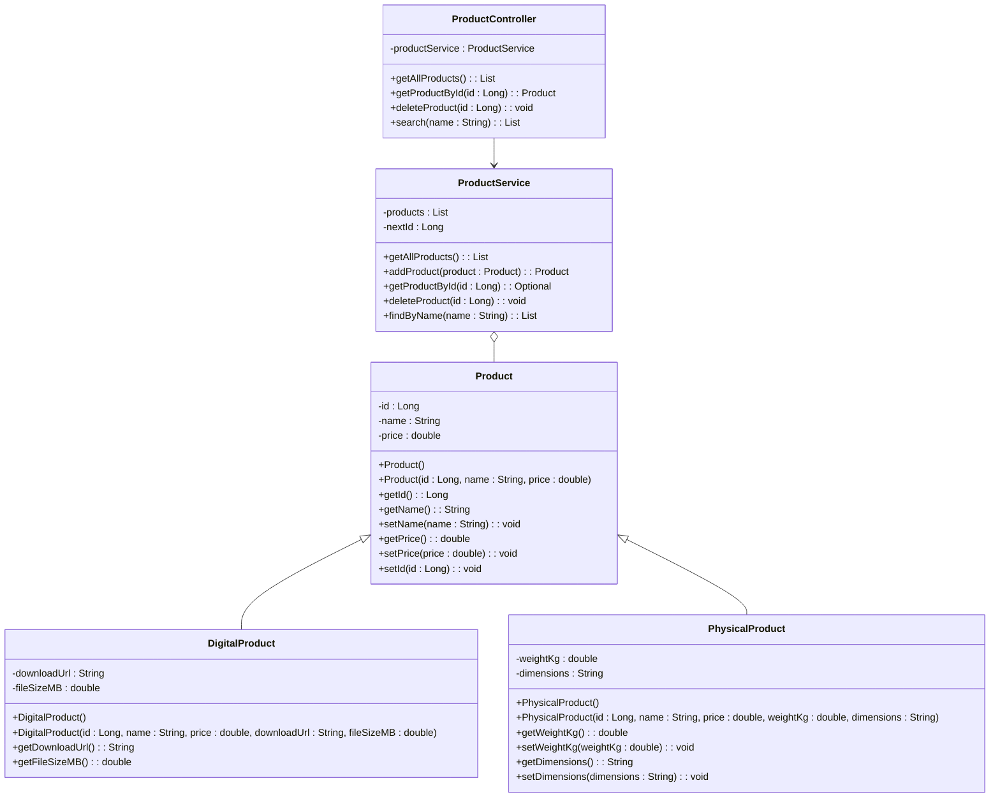

# Product Domain — UML Class Diagram

```mermaid
classDiagram
    class Product {
        -id : Long
        -name : String
        -price : double
        +Product()
        +Product(id : Long, name : String, price : double)
        +getId() : Long
        +getName() : String
        +setName(name : String) : void
        +getPrice() : double
        +setPrice(price : double) : void
        +setId(id : Long) : void
    }

    class DigitalProduct {
        -downloadUrl : String
        -fileSizeMB : double
        +DigitalProduct()
        +DigitalProduct(id : Long, name : String, price : double, downloadUrl : String, fileSizeMB : double)
        +getDownloadUrl() : String
        +getFileSizeMB() : double
    }

    class PhysicalProduct {
        -weightKg : double
        -dimensions : String
        +PhysicalProduct()
        +PhysicalProduct(id : Long, name : String, price : double, weightKg : double, dimensions : String)
        +getWeightKg() : double
        +setWeightKg(weightKg : double) : void
        +getDimensions() : String
        +setDimensions(dimensions : String) : void
    }

    class ProductService {
        -products : List<Product>
        -nextId : Long
        +getAllProducts() : List<Product>
        +addProduct(product : Product) : Product
        +getProductById(id : Long) : Optional<Product>
        +deleteProduct(id : Long) : void
        +findByName(name : String) : List<Product>
    }

    class ProductController {
        -productService : ProductService
        +getAllProducts() : List<Product>
        +getProductById(id : Long) : Product
        +deleteProduct(id : Long) : void
        +search(name : String) : List<Product>
    }

    Product <|-- DigitalProduct
    Product <|-- PhysicalProduct
    ProductService o-- Product
    ProductController --> ProductService
```
